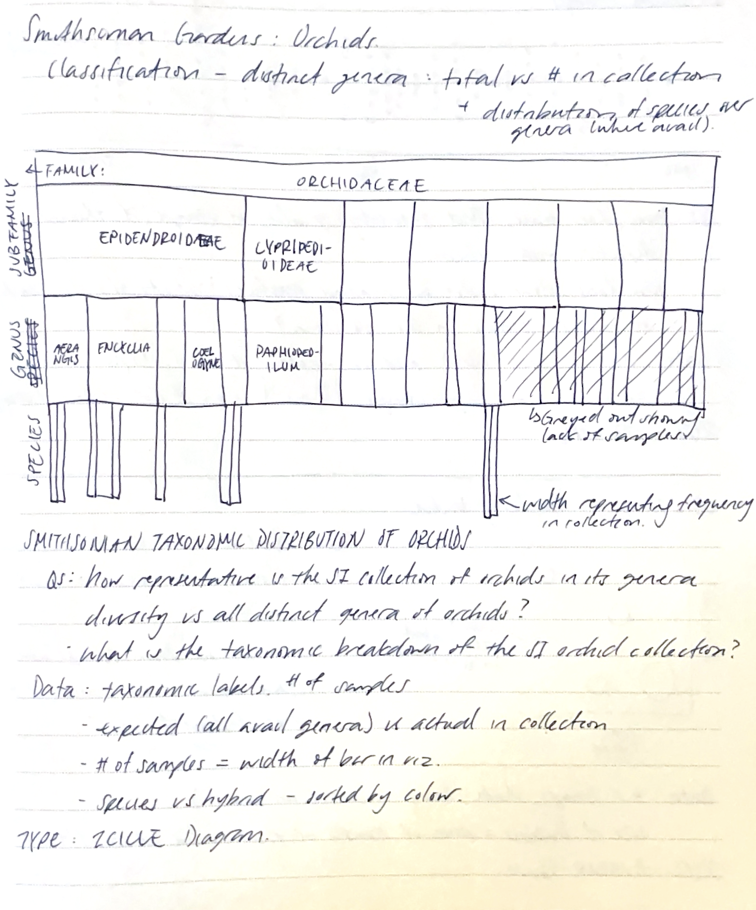
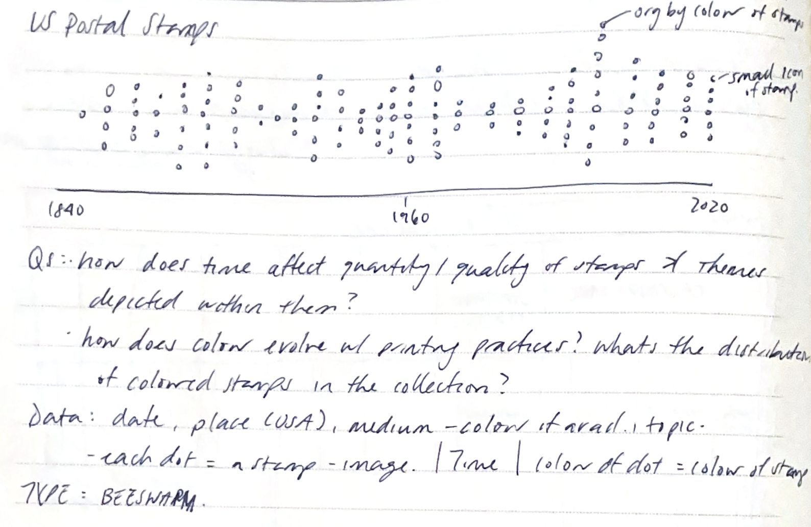
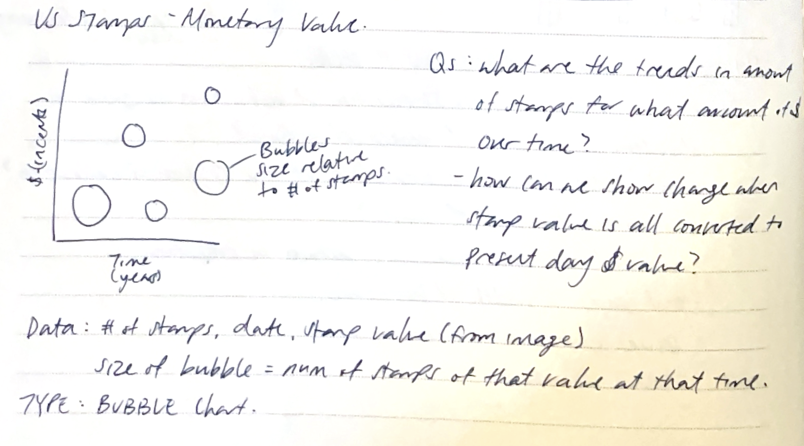

Smithsonian Gardens - Orchid Taxonomy Classification 

US Postal Stamps - Distribution of Ink Colours and Themes over Time 

US Postal Stamps - Distribution of Stamp Values over Time, grouped by common Values

