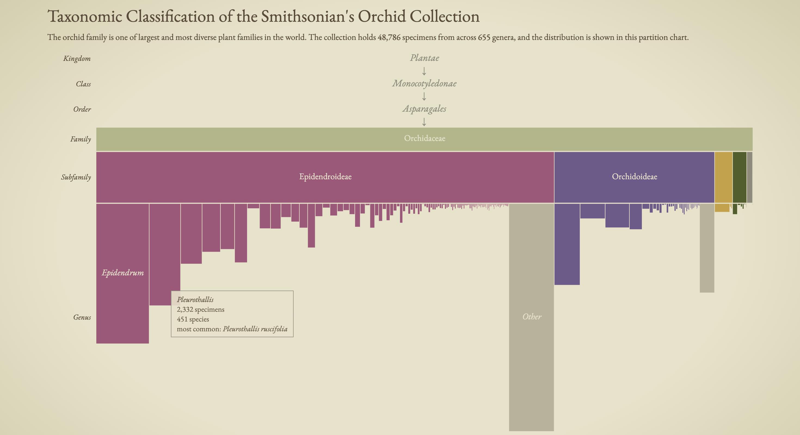
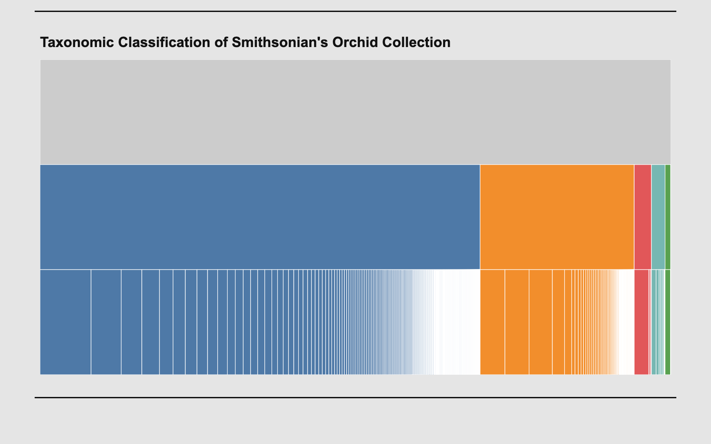

# Taxonomic Classification of Smithsonian's Orchid Collection

  A D3 visualization of the Smithsonian's orchid specimens, broken down by
  family, subfamily and genus.

  **Live:** https://larawashington-pgdv5200.github.io/Project-01/

  **Visualization**
  
  **Legend**
  

  ## Key finding
  The collection holds **48,786** specimens from **655** genera, and over half
  come from the 20 largest genera.

  ## Data
  - Source: [Smithsonian Open Access API](https://api.si.edu/openaccess/api/v1.0/search)
  - Query: `taxonomicName:"Plantae Monocotyledonae Asparagales Orchidaceae"`
  - Saved data file: `data/orchid.json`

  ## How to read
  - **Rows:** Family → Subfamily → Genus (Kingdom, Class and Order are shown
    above the chart as a single line of descent since they are the same for all orchid speciments)
  - **Width:** number of specimens
  - **Genus bar height:** number of species
    - **Note** the bar heights of Family and Subfamily are hardcoded
  - **Colour:** subfamily
  - **Grey:** "Other" meaning grouped genera with fewer than 50 specimens
  - **Hover:** shows specimen count, species count and the most common species

  ## Method
  - Each record's taxonomic name is split into ranks
  - Records with uncertain names (`cf.`, `aff.`, `sp.`, `Indet.`, hybrids) stop
    at the last rank they contained data on
  - Nested with `d3.group` and laid out with `d3.partition`

  ## Built with
  D3.js v7 · SVG

  ## Structure
  - `setup/`: fetches the data from the API
  - `data/`: the orchid dataset
  - `assets/`: screenshots of the visualization + early concept sketches

  ## Prototype
  **V1 Visualization** 
  